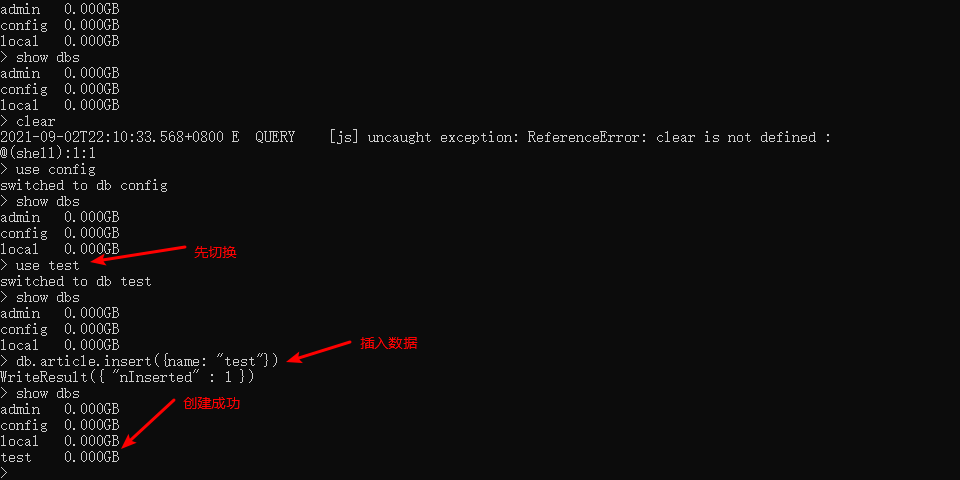

## 1. 相关概念

| 概念        | 描述                        |
| ----------- | --------------------------- |
| database    | 数据库                      |
| collection  | 集合                        |
| document    | 文档                        |
| field       | 域                          |
| index       | 索引                        |
| primary key | 主键，自动将 _id 设置为主键 |


## 2. 数据库操作

### 2.1 查询所有数据库

`show dbs`

### 2.2 切换数据库

 `use name`

### 2.3 创建数据库

 使用 `use` 命令创建数据库， 如果数据库不存在，那么当插入第一条数据时就会创建数据库。如果数据库已经存在则连接数据库

  

### 2.4 删除数据库

 `db.dropDatabase()`

### 2.5 查看当前数据库

 `db` 或者`db.getName()`

```shell
> db
test
```

### 2.6 显示当前数据库状态

 `db.stats()`

  


## 3. 集合操作

### 3.1 创建集合

`db.createCollection('name', options)` -> options 为集合配置项

**在 MongoDB 中，你不需要创建集合。当你插入一些文档时，MongoDB 会自动创建集合。**

```shell
> db.createCollection("round")
{ "ok" : 1 }
> show collections
round

> db.round2.insert({"name": "wen"})
WriteResult({ "nInserted": 1})
> show collections
round
round2
```

### 3.2 删除集合

`db.COLLECTION_NAME.drop()`: 使用 collection 对象的 `drop` 方法

```shell
> show collections
round
round2
> db.round2.drop()
true
> show collections
round
```

### 3.3 查看所有集合

`show collections` (主要) 或 `show tables`

## 4. 文档操作

### 4.1 插入文档

`db.COLLECTION_NAME.insert(document)`: 若插入的文档主键存在, 那么就抛出错误 -- 如果传入数组, 表示插入多条

```shell
> db.round.insert({ num: 1 })
WriteResult({"nInserted": 1})
```

### 4.2 更新文档

`db.collection.update(criteria, objNew, upsert, multi )`

- `criteria`:update的查询条件，类似sql update查询内where后面的
- `objNew`:update的对象和一些更新的操作符（如inc...）等，也可以理解为sql update查询内set后面的。
- `upsert` : 如果不存在update的记录，是否插入objNew,true为插入，默认是false，不插入。
- `multi` : mongodb默认是false,只更新找到的第一条记录，如果这个参数为true,就把按条件查出来多条记录全部更新。

```shell
# 只更新第一条记录：
db.col.update( { "count" : { $gt : 1 } } , { $set : { "test2" : "OK"} } );

# 全部更新：
db.col.update( { "count" : { $gt : 3 } } , { $set : { "test2" : "OK"} },false,true );

# 只添加第一条：
db.col.update( { "count" : { $gt : 4 } } , { $set : { "test5" : "OK"} },true,false );

# 全部添加进去:
db.col.update( { "count" : { $gt : 5 } } , { $set : { "test5" : "OK"} },true,true );

# 全部更新：
db.col.update( { "count" : { $gt : 15 } } , { $inc : { "count" : 1} },false,true );

#只更新第一条记录：
db.col.update( { "count" : { $gt : 10 } } , { $inc : { "count" : 1} },false,false );
```

### 4.3 删除文档

**执行 remove() 方法之前先执行 find() 判断一下执行条件是否正确是一个好策略**

`db.collection.remove(query[, options])`

- **query** :（可选）删除的文档的条件。 -- 在 2.6 以后, 必须要传, 如果删除所有文档, 则可以传入 {}, 并且不会删除索引
- **options**: 配置项
  - **justOne** : （可选）如果设为 true 或 1，则只删除一个文档，如果不设置该参数，或使用默认值 false，则删除所有匹配条件的文档。
  - **writeConcern** :（可选）抛出异常的级别。


参考文档：

* [MongoDB常用数据库命令大全](https://www.jb51.net/article/179844.htm)
* [MongoDB快速入门，掌握这些刚刚好！](https://juejin.cn/post/6844904150635921422#heading-7)
* [菜鸟教程](https://www.runoob.com/mongodb/mongodb-remove.html)

