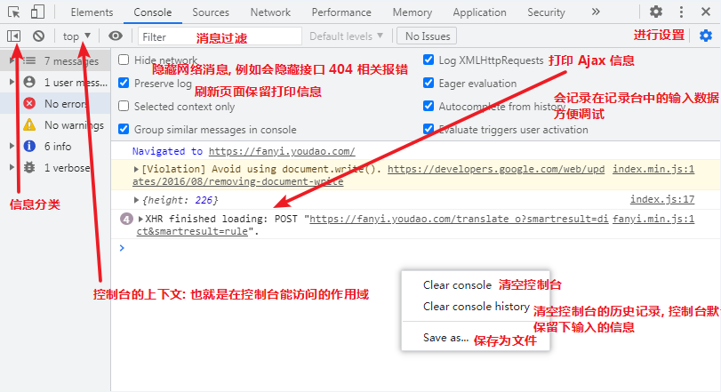
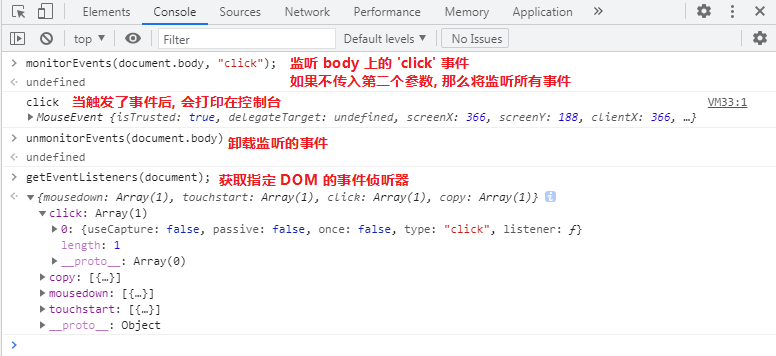

## 1. Console 面版基础功能

### 2. 事件监听器相关

- 使用`monitorEvents()`监听某一类型的事件。

- 使用`unmonitorEvents()`停止监听。

- 使用`getEventListeners()`获取DOM元素的监听器。

  

### 3. 命令行 API

* $_: 返回最近一次计算的表达式的值。

* $0-$4: 对`Elements`(元素)面板中检查的最后五个DOM元素或在`Profiles`(分析)面板中选择的最后五个JavaScript对象的历史引用。

* $(selector): 返回匹配指定CSS选择器的第一个DOM元素的引用。这个函数是`document.querySelector()`函数的别名。

  **注意: 如果你使用的库，如jQuery使用`$`，那么这个功能将被覆盖，并且`$`将对应用该库的实现。**

* $$(selector): 返回一个与给定CSS选择器匹配的元素数组。 此命令等效于调用`document.querySelectorAll()`。

* $x(path): 返回一个与给定XPath表达式匹配的DOM元素的数组。

* clear(): 清除控制台中所有历史记录。

* copy(object): 将指定对象的字符串表示复制到剪贴板。

  ...

  

