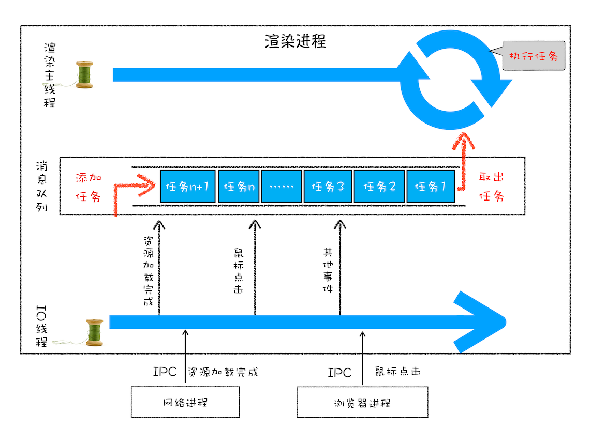
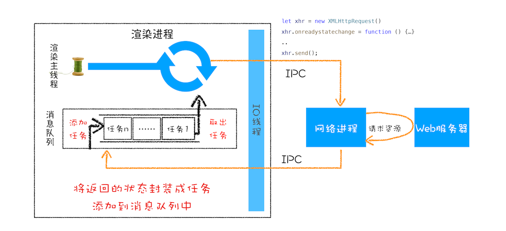
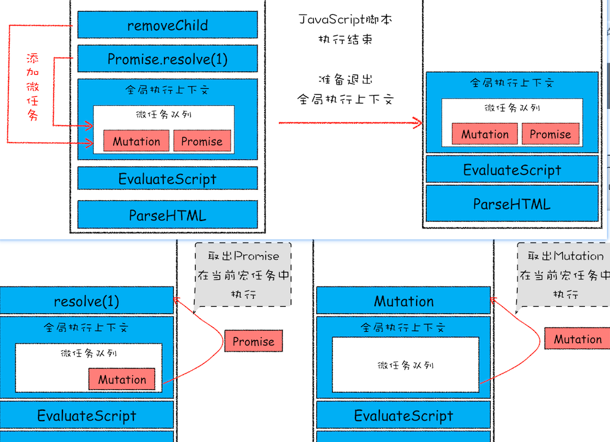

* 消息队列: 是一种数据结构，可以存放要执行的任务。它符合队列“先进先出”的特点，也就是说要添加任务的话，添加到队列的尾部；要取出任务的话，从队列头部去取。

* 事件循环: 是一种概念, 是用来循环消息队列, 执行任务

  

* 延迟队列: 独立于消息队列, 与消息队列类似, 维护着一些需要延迟执行的任务列表, 包括了**定时器和Chromium 内部一些需要延迟执行的任务**

  在合适的时机会将延迟队列的任务推入到消息队列中

* xhr 机制图解

  

* 消息队列

  * 宏任务: 包括如下任务:

    * 渲染事件（如解析 DOM、计算布局、绘制）；
    * 用户交互事件（如鼠标点击、滚动页面、放大缩小等）；
    * JavaScript 脚本执行事件；
    * 网络请求完成、文件读写完成事件。

  * 微任务: 当执行一段 js 脚本时,  V8 会为其创建一个全局执行上下文, **同时也会创建一个微任务队列, 用来存放微任务列表. 也就是说, 每个宏任务都关联了一个微任务队列**

    * promise

    * MutationObserver

      

