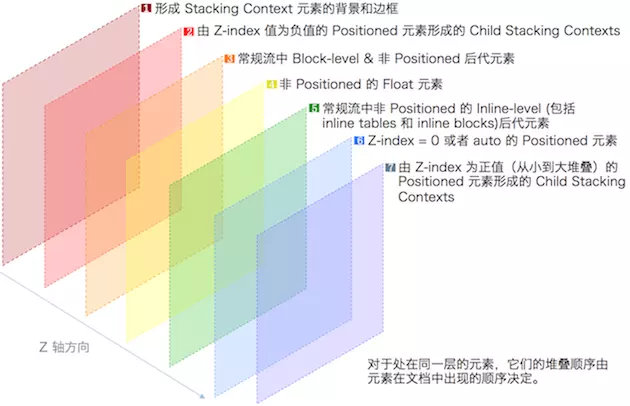

## 1. 层叠上下文

我们假定用户正面向（浏览器）视窗或网页，而 HTML 元素沿着其相对于用户的一条虚构的 z 轴排开，**层叠上下文**就是对这些 HTML 元素的一个三维构想。

文档中的层叠上下文由满足以下任意一个条件的元素形成：

- 文档根元素（`<html>`）；

- [`position`](https://developer.mozilla.org/zh-CN/docs/Web/CSS/position) 值为 `absolute`（绝对定位）或 `relative`（相对定位）且 [`z-index`](https://developer.mozilla.org/zh-CN/docs/Web/CSS/z-index) 值不为 `auto` 的元素；

- [`position`](https://developer.mozilla.org/zh-CN/docs/Web/CSS/position) 值为 `fixed`（固定定位）或 `sticky`（粘滞定位）的元素（沾滞定位适配所有移动设备上的浏览器，但老的桌面浏览器不支持）；

- flex ([`flexbox` (en-US)](https://developer.mozilla.org/en-US/docs/Web/CSS/CSS_Flexible_Box_Layout/Basic_Concepts_of_Flexbox)) 容器的子元素，且 [`z-index`](https://developer.mozilla.org/zh-CN/docs/Web/CSS/z-index) 值不为 `auto`；

- grid ([`grid`](https://developer.mozilla.org/zh-CN/docs/Web/CSS/grid)) 容器的子元素，且 [`z-index`](https://developer.mozilla.org/zh-CN/docs/Web/CSS/z-index) 值不为 `auto`；

- [`opacity`](https://developer.mozilla.org/zh-CN/docs/Web/CSS/opacity) 属性值小于 `1` 的元素（参见 [the specification for opacity](https://www.w3.org/TR/css3-color/#transparency)）；

- [`mix-blend-mode`](https://developer.mozilla.org/zh-CN/docs/Web/CSS/mix-blend-mode) 属性值不为 `normal` 的元素；

- 以下任意属性值不为`none`的元素：

  - [`transform`](https://developer.mozilla.org/zh-CN/docs/Web/CSS/transform)
  - [`filter`](https://developer.mozilla.org/zh-CN/docs/Web/CSS/filter)
  - [`perspective`](https://developer.mozilla.org/zh-CN/docs/Web/CSS/perspective)
  - [`clip-path`](https://developer.mozilla.org/zh-CN/docs/Web/CSS/clip-path)
  - [`mask`](https://developer.mozilla.org/zh-CN/docs/Web/CSS/mask) / [`mask-image`](https://developer.mozilla.org/zh-CN/docs/Web/CSS/mask-image) / [`mask-border`](https://developer.mozilla.org/zh-CN/docs/Web/CSS/mask-border)

- [`isolation`](https://developer.mozilla.org/zh-CN/docs/Web/CSS/isolation) 属性值为 `isolate` 的元素；

- [`-webkit-overflow-scrolling`](https://developer.mozilla.org/zh-CN/docs/Web/CSS/-webkit-overflow-scrolling) 属性值为 `touch` 的元素；

- [`will-change`](https://developer.mozilla.org/zh-CN/docs/Web/CSS/will-change) 值设定了任一属性而该属性在 non-initial 值时会创建层叠上下文的元素（参考[这篇文章](https://dev.opera.com/articles/css-will-change-property/)）；

- [`contain`](https://developer.mozilla.org/zh-CN/docs/Web/CSS/contain) 属性值为 `layout`、`paint` 或包含它们其中之一的合成值（比如 `contain: strict`、`contain: content`）的元素。

  

## 2. 合成层概念

某些特殊的渲染层会被认为是 **合成层**。合成层拥有单独的处理单元（GraphicsLayer）,而其他不是合成层的渲染层 Layer，则和第一个拥有独立处理单元的父层共用一个处理单元。

但是 层叠上下文 与 Layer 之间的关系可以 笼统地概括为：**有自己的 layer 的元素则必定是一个层叠上下文，而是层叠上下文的元素不一定有自己的 layer。**

## 3. layers 面板

暂时略